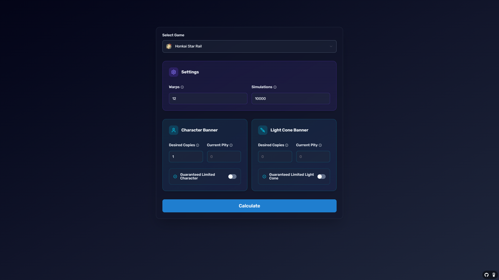
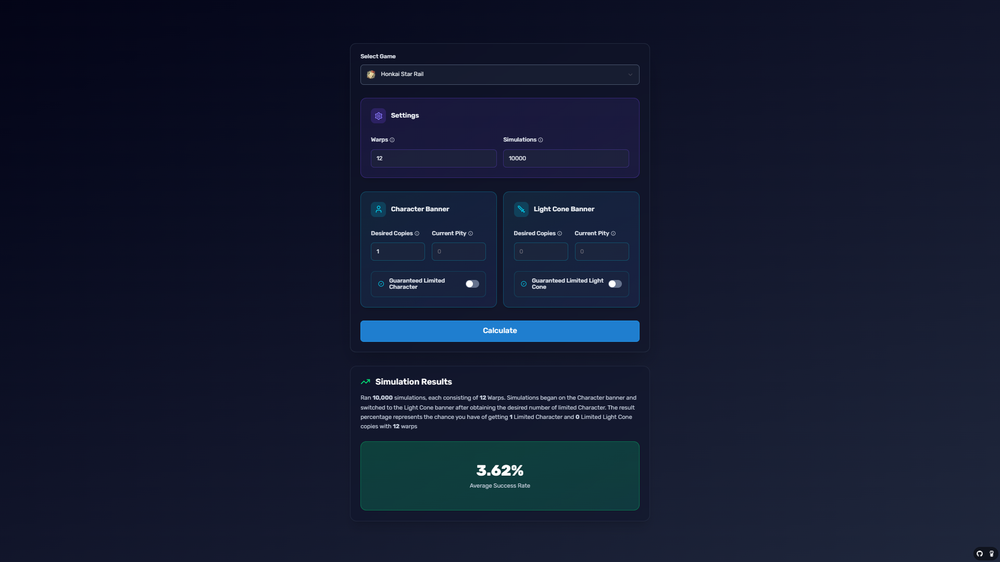
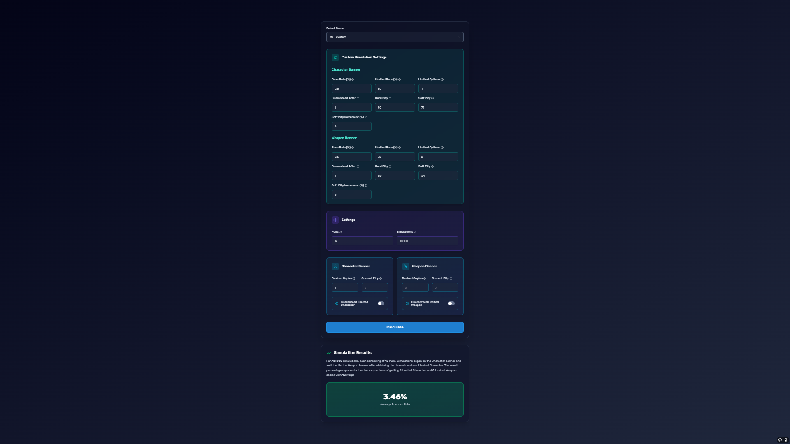

<a name="readme-top"></a>

<!-- PROJECT LOGO -->
<br />
<div align="center">
  <a href="https://github.com/Jose-AE/hsr-warp-calculator">
    
  </a>
<h3 align="center">Honkai Star Rail Warp Calculator</h3>

  <p align="center">
   A comprehensive Honkai: Star Rail Warp calculator, designed to calculate the probability of obtaining characters and lightcones based on the number of warps. Also includes calculators for other HoYoVerse games, providing a clear understanding of your chances when summoning in various games.
    <br />
    <a href="https://github.com/Jose-AE/hsr-warp-calculator"></a>
    <br />
    <a href="https://github.com/Jose-AE/hsr-warp-calculator/issues">Report Bug</a>
    ·
    <a href="https://github.com/Jose-AE/hsr-warp-calculator/issues">Request Feature</a>
  </p>
</div>

<!-- ABOUT THE PROJECT -->

## About The Project





### Built With

<a href="https://www.typescriptlang.org/" target="_blank" rel="noreferrer"><span></span></a>
<a href="https://reactjs.org/" target="_blank" rel="noreferrer"><span></span></a>
<a href="https://tailwindcss.com/" target="_blank" rel="noreferrer"><span></span></a>
<a href="https://nextjs.org/" target="_blank" rel="noreferrer"><span></span></a>

<!-- GETTING STARTED -->

### Installation

1. Install NPM packages
   ```sh
   npm install
   ```
2. Run in dev mode
   ```js
   npm run dev
   ```

<!-- LICENSE -->

## License

Distributed under the GNU GENERAL PUBLIC LICENSE v3. See `LICENSE.txt` for more information.

This project is not affiliated with HoYoVerse. Game content and materials are trademarks and copyrights of HoYoVerse.
